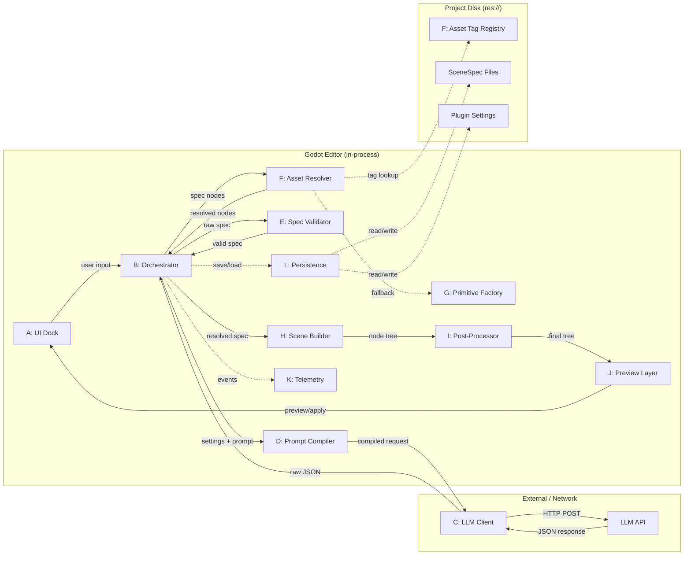
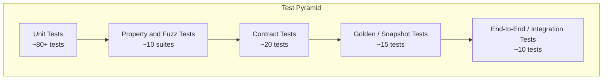
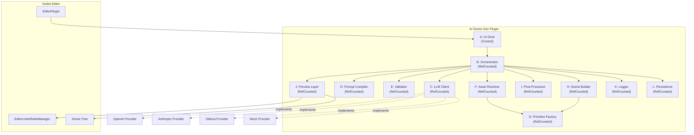
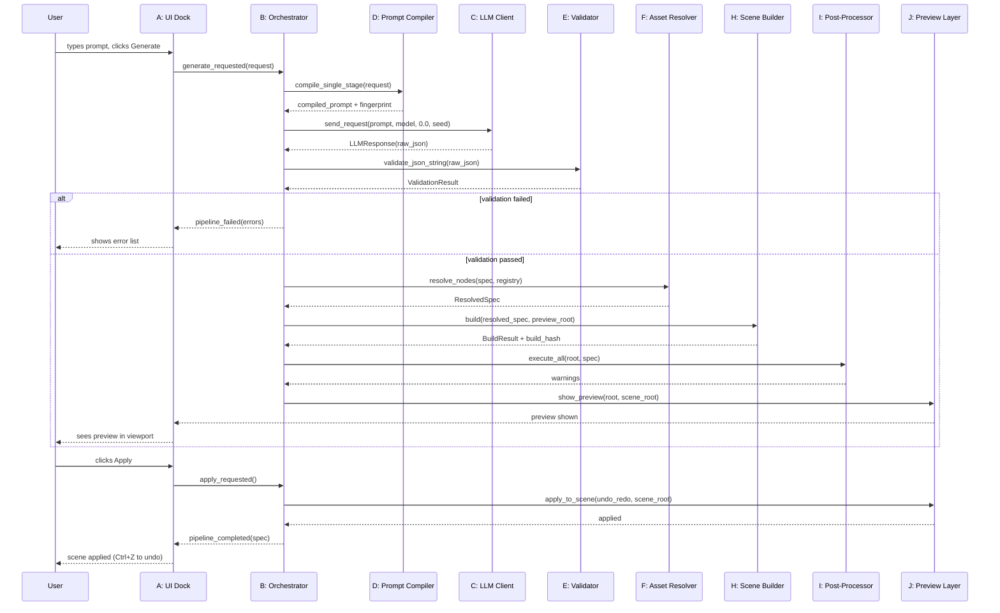
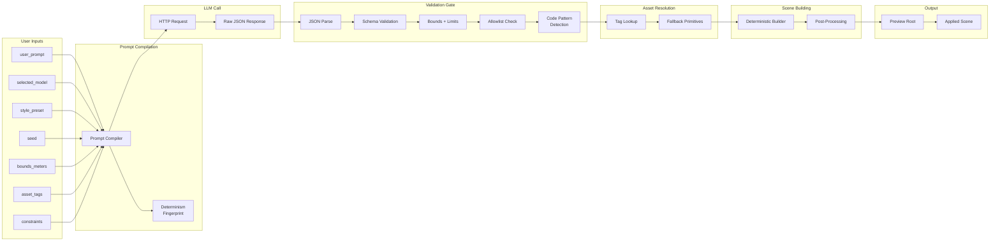
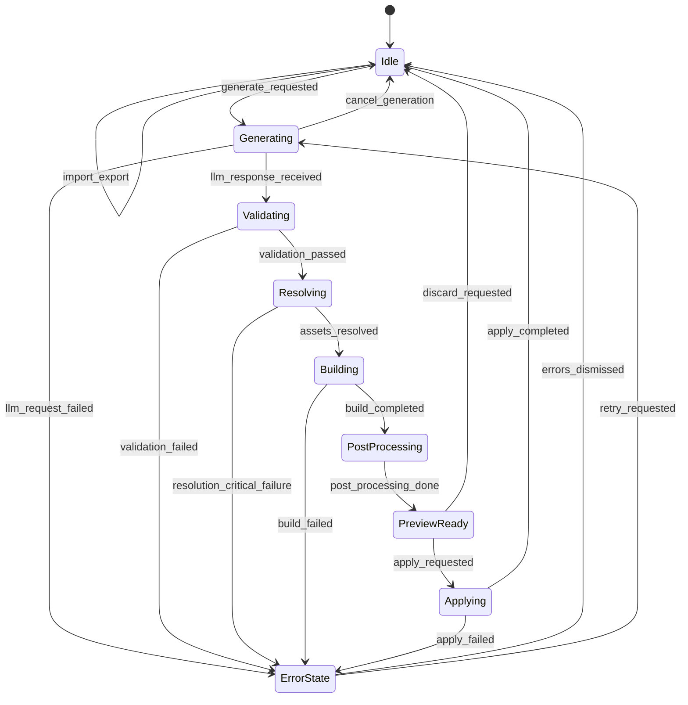
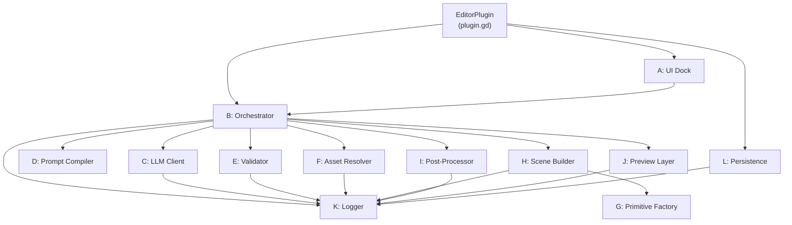

# AI Scene Generator Plugin — Integrated Architecture Document

> **Version:** 1.0.0
> **Status:** Implemented (Phase 1-6, Prio 1-3 done)
> **Target Engine:** Godot 4.4+ (tested on 4.6.1 stable)
> **Plugin Type:** `@tool` EditorPlugin (pure GDScript, no GDExtension)
> **Date:** 2026-02-25

---

## Table of Contents

- [1. Executive Summary](#1-executive-summary)
- [2. Requirements](#2-requirements)
  - [2.1 Functional Requirements](#21-functional-requirements)
  - [2.2 Non-Functional Requirements](#22-non-functional-requirements)
- [3. System Architecture (High Level)](#3-system-architecture-high-level)
- [4. Module Breakdown](#4-module-breakdown)
  - [4.A UI Dock Module](#4a-ui-dock-module)
  - [4.B Orchestrator / Pipeline Controller](#4b-orchestrator--pipeline-controller)
  - [4.C LLM Provider Interface + Implementations](#4c-llm-provider-interface--implementations)
  - [4.D Prompt Compiler](#4d-prompt-compiler)
  - [4.E SceneSpec Schema + Validator](#4e-scenespec-schema--validator)
  - [4.F Asset Tag Registry + Asset Resolver](#4f-asset-tag-registry--asset-resolver)
  - [4.G Procedural Primitive Factory](#4g-procedural-primitive-factory)
  - [4.H Scene Builder](#4h-scene-builder)
  - [4.I Post-Processing Passes](#4i-post-processing-passes)
  - [4.J Preview Layer + Diff](#4j-preview-layer--diff)
  - [4.K Telemetry / Logging](#4k-telemetry--logging)
  - [4.L Persistence](#4l-persistence)
- [5. Data Contracts](#5-data-contracts)
  - [5.1 SceneSpec JSON v1](#51-scenespec-json-v1)
  - [5.2 Error Contract](#52-error-contract)
  - [5.3 Asset Tag Contract](#53-asset-tag-contract)
- [6. LLM Interaction Design](#6-llm-interaction-design)
- [7. Automatic Error Testing & QA Strategy](#7-automatic-error-testing--qa-strategy)
  - [7.1 Test Pyramid Overview](#71-test-pyramid-overview)
  - [7.2 Test Cases Table](#72-test-cases-table)
  - [7.3 CI Plan](#73-ci-plan)
  - [7.4 Automatic Self-Check Step](#74-automatic-self-check-step)
- [8. Documentation Plan](#8-documentation-plan)
- [9. Architectural Diagrams](#9-architectural-diagrams)
- [10. Security & Safety Model](#10-security--safety-model)
- [11. Final Acceptance Checklist](#11-final-acceptance-checklist)
- [Glossary](#glossary)

**Cross-references:**

- Module interfaces and scope: [Section 4](#4-module-breakdown)
- Canonical data contracts: [Section 5](#5-data-contracts)
- QA and CI quality gates: [Section 7](#7-automatic-error-testing--qa-strategy)
- Operational controls and privacy: [Section 10](#10-security--safety-model)

---

## 1. Executive Summary

The **AI Scene Generator** is a Godot 4 `@tool` EditorPlugin that lets level designers type a natural-language prompt (e.g. *"a medieval courtyard with a well in the center"*) and receive a deterministic, validated 3D scene built directly in the editor viewport. The fundamental safety model guarantees that the LLM **never** produces or executes arbitrary code. Instead, the LLM outputs a strictly-validated JSON document (the **SceneSpec**) that describes scene nodes, transforms, materials, lights, and environment settings using an allowlisted vocabulary. The plugin's deterministic Scene Builder then constructs the Godot node tree from that spec. All transforms are clamped to user-defined bounds, all node types are checked against an explicit allowlist, and every step is logged and undoable. This architecture creates an air gap between AI output and engine execution: the AI is a *data author*, never a *code author*.

The plugin supports **optional project asset usage**. If the user's project contains tagged assets (meshes, materials, PackedScenes) registered in the **Asset Tag Registry**, the plugin resolves SceneSpec references against those tags and instantiates real project assets. When a tag has no match -- or when no tags are registered at all -- the plugin falls back to **safe procedural primitives** (boxes, spheres, cylinders, planes, capsules) from the **Procedural Primitive Factory**. This guarantees the plugin always produces a valid, renderable scene regardless of project state, making it equally useful for grey-box prototyping and asset-rich production work.

---

## 2. Requirements

### 2.1 Functional Requirements

| ID | Requirement | Priority |
|----|------------|----------|
| FR-01 | **Prompt input UI** -- A dock panel with a multi-line text field (max 2000 chars) for the user prompt, a "Generate" button, and status feedback. | Must |
| FR-02 | **LLM selector** -- Dropdown to pick provider (OpenAI, Anthropic, local Ollama, mock) and model name. API key entry per provider. | Must |
| FR-03 | **Style preset selector** -- Dropdown with presets: `blockout`, `stylized`, `realistic-lite`. Affects prompt compilation and material defaults. | Must |
| FR-04 | **Seed control** -- Integer seed field with randomize button. Same seed + same prompt + same settings = identical SceneSpec. | Must |
| FR-05 | **Bounds control** -- Three float spinboxes for scene bounding box in meters `[x, y, z]`. All generated transforms clamped to bounds. | Must |
| FR-06 | **Generate action** -- Triggers the full pipeline: compile prompt -> call LLM -> validate SceneSpec -> resolve assets -> build scene -> post-process -> preview. | Must |
| FR-07 | **Preview mode** -- Generated scene appears under a temporary `_AIPreviewRoot` node. User can orbit/inspect before committing. | Must |
| FR-08 | **Apply action** -- Reparents preview nodes into the active scene tree. Registered with Godot's `EditorUndoRedoManager` so Ctrl+Z reverts the entire apply. | Must |
| FR-09 | **Discard action** -- Removes `_AIPreviewRoot` and all children without affecting the scene. | Must |
| FR-10 | **Import/Export SceneSpec** -- Save last SceneSpec to `.scenespec.json`; load and rebuild from file. | Must |
| FR-11 | **Validation error display** -- Errors from validator and builder shown in a scrollable list with severity icon, path, message, and fix hint. | Must |
| FR-12 | **Offline/mock mode** -- Built-in mock LLM provider returns canned SceneSpecs for testing without network. | Must |
| FR-13 | **Asset tag browser** -- Optional panel listing registered asset tags, their resource paths, and preview thumbnails. | Should |
| FR-14 | **Variation mode** -- When enabled, appends a random variation suffix to the LLM prompt to produce different layouts from the same seed. | Should |
| FR-15 | **Constraint input** -- Optional text field for project constraints (max nodes, VR-ready, performance tier). Passed to prompt compiler. | Should |

### 2.2 Non-Functional Requirements

| ID | Requirement | Target |
|----|------------|--------|
| NFR-01 | **Determinism** -- Identical inputs (prompt + seed + settings + SceneSpec version) produce byte-identical SceneSpec JSON. Verified via determinism fingerprint. | 100% reproducible |
| NFR-02 | **Node budget** -- Default max 256 nodes per generation. Configurable up to 1024. | Hard limit enforced by validator |
| NFR-03 | **Poly proxy budget** -- Procedural primitives stay under 50,000 total triangles (sum of all generated meshes). | Soft warning at 80%, hard reject at 100% |
| NFR-04 | **Generation latency** -- UI remains responsive during LLM call (async HTTP). Target: preview ready < 15 s for simple scenes on a fast connection. | Best effort |
| NFR-05 | **Security boundary** -- LLM output is never `eval`'d, never passed to `Expression`, never written to disk as executable. Only parsed as JSON. | Absolute |
| NFR-06 | **No arbitrary file access** -- Asset resolver only reads paths under `res://`. No `user://` or absolute paths. | Absolute |
| NFR-07 | **Extensibility** -- New LLM providers added by implementing `LLMProvider` interface. New primitive generators added by registering with the factory. New post-processors added to the pass list. | Plugin architecture |
| NFR-08 | **Undo/Redo** -- Every scene mutation goes through `EditorUndoRedoManager`. | 100% coverage |
| NFR-09 | **Godot version** -- Compatible with Godot 4.4+. No GDExtension dependencies. Pure GDScript. | Hard requirement |
| NFR-10 | **Privacy** -- Only the compiled prompt text is sent to the LLM. No file paths, no project names, no telemetry unless opted in. | Default off |

---

## 3. System Architecture (High Level)



**Boundary rules:**

- Everything inside the `editor` subgraph runs in the Godot editor process as `@tool` scripts.
- The `LLMClient` module makes outbound HTTPS requests only. No inbound connections.
- Disk access is limited to `res://` for assets and `res://addons/ai_scene_gen/` for plugin data.
- The `LLM API` is the only external dependency. When unreachable, the mock provider is used.

---

## 4. Module Breakdown

### 4.A UI Dock Module

**Responsibilities:**

- Render the plugin dock panel (prompt field, dropdowns, buttons, error list, status bar).
- Collect user inputs and pass them to the Orchestrator as a typed `GenerationRequest` dictionary.
- Display generation progress, preview controls, and validation errors.
- Provide Import/Export buttons for SceneSpec files.

**Does NOT:**

- Perform any generation logic, validation, or scene manipulation directly.
- Make network calls.
- Access the scene tree beyond reading the current scene root for context.

**Public Interface (signatures only):**

```text
class_name AiSceneGenDock extends Control

signal generate_requested(request: Dictionary)
signal apply_requested()
signal discard_requested()
signal import_requested(path: String)
signal export_requested(path: String)
signal provider_changed(provider_name: String)

func set_state(new_state: int) -> void
func show_errors(errors: Array[Dictionary]) -> void
func show_progress(percent: float, message: String) -> void
func set_provider_list(providers: Array[String]) -> void
func set_model_list(models: Array[String]) -> void
func get_generation_request() -> Dictionary
```

**Inputs / Outputs:**

| Direction | Data | Type |
|-----------|------|------|
| In | Provider/model lists | `Array[String]` |
| In | Validation errors | `Array[Dictionary]` (see [5.2](#52-error-contract)) |
| In | State transitions | `int` enum (see state machine in [Section 9](#9-architectural-diagrams)) |
| Out | `GenerationRequest` | `Dictionary` with keys: `user_prompt`, `selected_model`, `selected_provider`, `style_preset`, `seed`, `bounds_meters`, `available_asset_tags`, `project_constraints` |

**Failure Modes:**

| Code | Condition | Message |
|------|-----------|---------|
| `UI_ERR_EMPTY_PROMPT` | Generate pressed with blank prompt | "Please enter a scene description." |
| `UI_ERR_NO_PROVIDER` | No provider selected/configured | "Select an LLM provider and enter an API key." |
| `UI_ERR_INVALID_BOUNDS` | Any bound axis <= 0 or > 1000 | "Bounds must be between 0.1 and 1000 meters per axis." |
| `UI_ERR_INVALID_SEED` | Seed is not an integer or out of range | "Seed must be an integer between 0 and 2,147,483,647." |

**Observability:**

- Log category: `ai_scene_gen.ui`
- Events emitted: `ui_state_changed`, `generate_button_pressed`, `apply_button_pressed`

**Test Plan:**

- **Unit:** Verify `get_generation_request()` returns correct dictionary shape for known inputs. Verify `set_state()` enables/disables correct buttons. Verify `show_errors()` populates error list with correct count and severity icons.
- **Contract:** Input dictionary matches `GenerationRequest` schema keys and types.
- **Negative:** Empty prompt triggers `UI_ERR_EMPTY_PROMPT`. Bounds of `[0, 0, 0]` triggers `UI_ERR_INVALID_BOUNDS`. Extremely long prompt (>2,000 chars) is truncated with a warning.

---

### 4.B Orchestrator / Pipeline Controller

**Responsibilities:**

- Owns the generation pipeline state machine (Idle -> Generating -> Validating -> Resolving -> Building -> PostProcessing -> PreviewReady; plus Error from any state).
- Sequences module calls: Prompt Compiler -> LLM Client -> Spec Validator -> Asset Resolver -> Scene Builder -> Post-Processors -> Preview Layer.
- Handles cancellation, retries (max 2 for JSON parse, max 1 for schema errors), and error aggregation.
- Integrates with `EditorUndoRedoManager` for apply/discard.
- Generates a determinism fingerprint for each run and verifies reproducibility.

**Does NOT:**

- Implement any individual pipeline step. Delegates everything.
- Directly interact with the UI (communicates via signals).
- Make network calls (delegates to LLM Client).

**Public Interface:**

```text
class_name AiSceneGenOrchestrator extends RefCounted

signal pipeline_state_changed(old_state: int, new_state: int)
signal pipeline_progress(percent: float, message: String)
signal pipeline_completed(spec: Dictionary)
signal pipeline_failed(errors: Array[Dictionary])

func start_generation(request: Dictionary, scene_root: Node3D) -> void
func cancel_generation() -> void
func apply_preview(undo_redo: EditorUndoRedoManager, scene_root: Node3D) -> void
func discard_preview() -> void
func rebuild_from_spec(spec: Dictionary, scene_root: Node3D) -> void
func get_current_state() -> int
func get_last_spec() -> Dictionary
func get_last_errors() -> Array[Dictionary]
```

> **Note:** `build_determinism_fingerprint()` lives on the `PromptCompiler`, not the Orchestrator. The Orchestrator calls it internally via `_prompt_compiler.build_determinism_fingerprint(request)`.

**Inputs / Outputs:**

| Direction | Data | Type |
|-----------|------|------|
| In | `GenerationRequest` | `Dictionary` from UI Dock |
| In | `EditorUndoRedoManager` | Godot built-in |
| Out | Pipeline state changes | Signal with `int` enum |
| Out | Completed SceneSpec | `Dictionary` |
| Out | Aggregated errors | `Array[Dictionary]` |

**Failure Modes:**

| Code | Condition | Message |
|------|-----------|---------|
| `ORCH_ERR_ALREADY_RUNNING` | `start_generation` called while pipeline active | "A generation is already in progress. Cancel or wait." |
| `ORCH_ERR_RETRY_EXHAUSTED` | LLM call failed after 2 retries | "LLM request failed after 2 retries: {reason}" |
| `ORCH_ERR_CANCELLED` | User cancelled during generation | "Generation cancelled by user." |
| `ORCH_ERR_STAGE_FAILED` | Any pipeline stage returned errors | "Pipeline failed at stage '{stage_name}': {error_summary}" |
| `ORCH_ERR_NONDETERMINISM` | Fingerprint mismatch on same inputs | "Nondeterminism detected: fingerprint mismatch." |

**Observability:**

- Log category: `ai_scene_gen.orchestrator`
- Events: `pipeline_started`, `pipeline_stage_entered`, `pipeline_completed`, `pipeline_failed`, `pipeline_cancelled`
- Metrics: `generation_duration_ms`, `retry_count`, `stage_durations_ms`, `determinism_fingerprint`

**Test Plan:**

- **Unit:** Verify state transitions follow the state machine. Verify cancellation from each state returns to Idle. Verify retry logic triggers exactly 2 retries on transient failure, then emits `ORCH_ERR_RETRY_EXHAUSTED`.
- **Contract:** `start_generation` rejects invalid request dictionaries (missing keys). `apply_preview` requires state = PreviewReady.
- **Negative:** Calling `apply_preview` in Idle state raises `ORCH_ERR_STAGE_FAILED`. Double `start_generation` raises `ORCH_ERR_ALREADY_RUNNING`.

---

### 4.C LLM Provider Interface + Implementations

**Responsibilities:**

- Define a pluggable interface for LLM communication.
- Ship with implementations: `OllamaProvider`, `MockProvider`. Future: `OpenAIProvider`, `AnthropicProvider` (not yet implemented).
- Handle HTTP transport, auth headers, rate limits, and timeouts.
- Return raw JSON string (unparsed) to the Orchestrator.
- Provide a `health_check()` method for connection validation.

**Does NOT:**

- Parse or validate the LLM response content (that's the Validator's job).
- Store API keys (reads them from Persistence module at call time).
- Retry (Orchestrator handles retries).

**Public Interface:**

```text
class_name LLMProvider extends RefCounted

func get_provider_name() -> String
func get_available_models() -> Array[String]
func is_configured() -> bool
func health_check() -> Dictionary
func send_request(compiled_prompt: String, model: String, temperature: float, seed: int) -> LLMResponse

class_name LLMResponse extends RefCounted

func is_success() -> bool
func get_raw_body() -> String
func get_error_code() -> String
func get_error_message() -> String
func get_latency_ms() -> int
func get_token_usage() -> Dictionary
```

**Provider Implementations:**

| Provider | Endpoint | Auth | Notes |
|----------|----------|------|-------|
| `OllamaProvider` | `http://localhost:11434/api/generate` | None (local) | Requires Ollama running locally. Configurable base URL via `set_base_url()`. |
| `MockProvider` | N/A | None | Returns canned specs from `res://addons/ai_scene_gen/mocks/` |
| `OpenAIProvider` | `https://api.openai.com/v1/chat/completions` | Bearer token | **Planned, not yet implemented** |
| `AnthropicProvider` | `https://api.anthropic.com/v1/messages` | `x-api-key` header | **Planned, not yet implemented** |

**Failure Modes:**

| Code | Condition | Message |
|------|-----------|---------|
| `LLM_ERR_NOT_CONFIGURED` | API key missing or empty | "Provider '{name}' is not configured. Set API key in settings." |
| `LLM_ERR_TIMEOUT` | HTTP request exceeded 60 s | "LLM request timed out after 60 seconds." |
| `LLM_ERR_RATE_LIMIT` | HTTP 429 received | "Rate limited by provider. Wait and retry." |
| `LLM_ERR_AUTH` | HTTP 401/403 received | "Authentication failed. Check your API key." |
| `LLM_ERR_SERVER` | HTTP 5xx received | "LLM server error ({status_code}). Try again later." |
| `LLM_ERR_NETWORK` | Connection refused / DNS failure | "Cannot reach LLM provider. Check network or use offline mode." |
| `LLM_ERR_NON_JSON` | Response body is not JSON-parseable | "LLM returned non-JSON output." |

**Observability:**

- Log category: `ai_scene_gen.llm`
- Events: `llm_request_sent`, `llm_response_received`, `llm_request_failed`
- Metrics: `llm_latency_ms`, `llm_tokens_prompt`, `llm_tokens_completion`, `json_compliance_rate`

**Test Plan:**

- **Unit:** `MockProvider` returns valid canned JSON. Each error code is returned for the matching HTTP status. `is_configured()` returns false when key is empty. `health_check()` returns connection status.
- **Contract:** `LLMResponse` always has `is_success()`, `get_raw_body()`, and `get_error_code()`. `get_raw_body()` is never null (empty string on failure).
- **Negative:** Timeout after 60 s. Malformed URL in provider config returns `LLM_ERR_NETWORK`. Empty model string returns `LLM_ERR_NOT_CONFIGURED`.

---

### 4.D Prompt Compiler

**Responsibilities:**

- Take a `GenerationRequest` and produce a fully-formed LLM prompt string.
- Inject the system instruction template (see [Section 6](#6-llm-interaction-design)).
- Embed style preset modifiers, seed, bounds, asset tags, and constraints into the prompt.
- Support two-stage mode (Plan -> SceneSpec) and single-stage mode.
- Generate a determinism fingerprint from the compiled inputs.

**Does NOT:**

- Call the LLM. Only produces the prompt text.
- Validate the LLM response.
- Access the file system or network.

**Public Interface:**

```text
class_name PromptCompiler extends RefCounted

func compile_single_stage(request: Dictionary) -> String
func compile_plan_stage(request: Dictionary) -> String
func compile_spec_stage(request: Dictionary, plan_text: String) -> String
func get_system_instruction() -> String
func estimate_token_count(prompt: String) -> int
func build_determinism_fingerprint(request: Dictionary) -> String
```

**Inputs / Outputs:**

| Direction | Data | Type |
|-----------|------|------|
| In | `GenerationRequest` | `Dictionary` |
| In | Plan text (for two-stage) | `String` |
| Out | Compiled prompt | `String` |
| Out | Token estimate | `int` |
| Out | Determinism fingerprint | `String` |

**Failure Modes:**

| Code | Condition | Message |
|------|-----------|---------|
| `PROMPT_ERR_EMPTY` | `user_prompt` is empty after trimming | "Cannot compile an empty prompt." |
| `PROMPT_ERR_TOO_LONG` | Estimated tokens > 12,000 | "Prompt exceeds 12,000 token estimate. Simplify or reduce constraints." |
| `PROMPT_ERR_INVALID_PRESET` | `style_preset` not in `[blockout, stylized, realistic-lite]` | "Unknown style preset: '{value}'." |
| `PROMPT_ERR_CONSTRAINT_CONFLICT` | Contradictory constraints detected | "Conflicting constraints: {details}." |

**Observability:**

- Log category: `ai_scene_gen.prompt_compiler`
- Events: `prompt_compiled`
- Metrics: `prompt_token_estimate`, `prompt_length_chars`, `determinism_fingerprint`

**Test Plan:**

- **Unit:** Known request -> known prompt substring assertions. Verify seed is embedded. Verify bounds are embedded as JSON array. Verify asset tags appear in the "available assets" section of the prompt. Determinism fingerprint is stable for identical inputs.
- **Contract:** Output is always a non-empty string. Token estimate is always > 0 for non-empty input.
- **Negative:** Empty prompt raises `PROMPT_ERR_EMPTY`. Unknown preset raises `PROMPT_ERR_INVALID_PRESET`. Prompt with 50,000 chars triggers `PROMPT_ERR_TOO_LONG`. Injection strings in raw prompt are not executed (only concatenated).

---

### 4.E SceneSpec Schema + Validator

**Responsibilities:**

- Define the canonical **SceneSpec v1.0.0** JSON schema (see [Section 5.1](#51-scenespec-json-v1)).
- Validate any JSON string or Dictionary against the schema.
- Return structured errors with JSON-path pointers and fix hints.
- Enforce all limits: max nodes, max scale, max light energy, bounds compliance.
- Reject unknown node types and primitive shapes (allowlist enforcement).
- Detect code injection patterns in string fields.

**Does NOT:**

- Build scenes. Only validates data.
- Modify the spec (no auto-fixing; returns errors for the caller to handle or display).
- Interact with the file system or the scene tree.

**Public Interface:**

```text
class_name SceneSpecValidator extends RefCounted

func validate_json_string(raw_json: String) -> ValidationResult
func validate_spec(spec: Dictionary) -> ValidationResult
func get_schema_version() -> String
func get_allowed_node_types() -> Array[String]
func get_allowed_primitive_shapes() -> Array[String]

class_name ValidationResult extends RefCounted

func is_valid() -> bool
func get_errors() -> Array[Dictionary]
func get_warnings() -> Array[Dictionary]
func get_spec_or_null() -> Dictionary
```

**Allowlisted Node Types:**

`MeshInstance3D`, `StaticBody3D`, `DirectionalLight3D`, `OmniLight3D`, `SpotLight3D`, `Camera3D`, `WorldEnvironment`, `Node3D`

**Allowlisted Primitive Shapes:**

`box`, `sphere`, `cylinder`, `capsule`, `plane`

**Failure Modes:**

| Code | Condition | Message |
|------|-----------|---------|
| `SPEC_ERR_PARSE` | JSON parse failure | "Invalid JSON at position {pos}: {detail}" |
| `SPEC_ERR_VERSION` | Missing or unknown `spec_version` | "Unknown SceneSpec version: '{v}'. Expected '1.0.0'." |
| `SPEC_ERR_MISSING_FIELD` | Required field absent | "Missing required field at '{path}'." |
| `SPEC_ERR_TYPE` | Field has wrong type | "Expected {expected} at '{path}', got {actual}." |
| `SPEC_ERR_NODE_TYPE` | Node type not in allowlist | "Disallowed node_type '{type}' at '{path}'. Allowed: {list}." |
| `SPEC_ERR_PRIMITIVE` | Primitive shape not in allowlist | "Unknown primitive_shape '{shape}' at '{path}'. Allowed: {list}." |
| `SPEC_ERR_BOUNDS` | Transform position outside bounds | "Position {pos} at '{path}' exceeds bounds {bounds}." |
| `SPEC_ERR_LIMIT_NODES` | Node count exceeds limit | "Node count {n} exceeds limit of {max}." |
| `SPEC_ERR_LIMIT_SCALE` | Scale component > max | "Scale {s} at '{path}' exceeds max of {max}." |
| `SPEC_ERR_LIMIT_ENERGY` | Light energy > max | "Light energy {e} at '{path}' exceeds max of {max}." |
| `SPEC_ERR_DUPLICATE_ID` | Two nodes share the same `id` | "Duplicate node id '{id}' found." |
| `SPEC_ERR_CODE_PATTERN` | Suspicious code pattern in string field | "Forbidden code pattern detected in '{path}': '{pattern}'." |
| `SPEC_ERR_ADDITIONAL_FIELD` | Unexpected field in spec | "Unknown field '{field}' at '{path}'. Spec uses strict schema." |
| `SPEC_WARN_POLY_BUDGET` | Estimated tris > 80% of budget | "Estimated triangle count ({n}) exceeds 80% of budget ({budget})." |
| `SPEC_WARN_NO_GROUND` | No ground plane detected | "No ground node found. Scene may float." |
| `SPEC_WARN_NO_LIGHTS` | Empty lights array | "No lights defined. Scene will be dark." |

**Observability:**

- Log category: `ai_scene_gen.validator`
- Events: `validation_passed`, `validation_failed`
- Metrics: `validation_error_count`, `validation_warning_count`, `validation_duration_ms`

**Test Plan:**

- **Unit:** Valid example specs pass with zero errors. Each error code is triggered by a targeted malformed spec. Allowlist rejects `GDScript`, `Expression`, `ScriptEditor`.
- **Contract:** `ValidationResult.get_errors()` always returns `Array[Dictionary]` with keys `code`, `message`, `path`, `severity`, `fix_hint`, `stage`. `is_valid()` returns `true` only when error count = 0.
- **Negative:** Empty string -> `SPEC_ERR_PARSE`. `{"meta":{}}` -> `SPEC_ERR_MISSING_FIELD` for `spec_version`. Node count of 9999 -> `SPEC_ERR_LIMIT_NODES`. Position `[9999, 0, 0]` with bounds `[50, 50, 50]` -> `SPEC_ERR_BOUNDS`.
- **Fuzz/Property:** Generate 1000 random dictionaries with valid structure but random values; validator must never crash (always returns a `ValidationResult`). Generate specs with node counts from 0 to 2000; verify limit enforcement triggers at the configured threshold.

---

### 4.F Asset Tag Registry + Asset Resolver

**Responsibilities:**

- **Registry:** Maintain a mapping of string tags to `res://` resource paths and metadata (type, thumbnail path, poly count estimate, fallback primitive hint).
- **Resolver:** Given a SceneSpec node with an `asset_tag`, look up the registry. If found, annotate the node with the resolved resource path. If not found, mark it for fallback to the Procedural Primitive Factory.
- Support `.tres` resource files for registry persistence.
- Deterministic tag resolution via stable sort + seeded selection when multiple variants exist.

**Does NOT:**

- Load or instantiate resources (Scene Builder does that).
- Access paths outside `res://`.
- Create or modify assets on disk.

**Public Interface:**

```text
class_name AssetTagRegistry extends Resource

func register_tag(tag: String, resource_path: String, metadata: Dictionary) -> void
func unregister_tag(tag: String) -> void
func has_tag(tag: String) -> bool
func get_entry(tag: String) -> Dictionary
func get_all_tags() -> Array[String]
func save_to_file(path: String) -> int
func load_from_file(path: String) -> int

class_name AssetResolver extends RefCounted

func resolve_nodes(spec: Dictionary, registry: AssetTagRegistry) -> ResolvedSpec

class_name ResolvedSpec extends RefCounted

func get_spec() -> Dictionary
func get_resolved_count() -> int
func get_fallback_count() -> int
func get_missing_tags() -> Array[String]
```

**Failure Modes:**

| Code | Condition | Message |
|------|-----------|---------|
| `ASSET_ERR_PATH_INVALID` | Registered path does not start with `res://` | "Asset path '{path}' is not under res://." |
| `ASSET_ERR_NOT_FOUND` | Registered path does not exist on disk | "Asset file not found: '{path}'. Tag '{tag}' will use fallback." |
| `ASSET_WARN_TAG_MISS` | Spec references tag not in registry | "Tag '{tag}' not found in registry. Using primitive fallback." |

**Observability:**

- Log category: `ai_scene_gen.asset_resolver`
- Events: `tag_resolved`, `tag_fallback`, `registry_loaded`, `registry_saved`
- Metrics: `resolved_count`, `fallback_count`, `missing_tag_count`, `hit_rate`

**Test Plan:**

- **Unit:** Register a tag, resolve a spec referencing it -> `_resolved_path` set. Resolve a spec with unknown tag -> `_fallback: true`. Empty registry -> all nodes get fallback. Deterministic pick with same seed produces same result.
- **Contract:** `ResolvedSpec.get_spec()` has same structure as input spec plus `_resolved_path` or `_fallback` annotations. `get_missing_tags()` lists exactly the unresolved tags.
- **Negative:** Register a path starting with `C:\` -> `ASSET_ERR_PATH_INVALID`. Register a valid `res://` path that does not exist -> `ASSET_ERR_NOT_FOUND`. Path traversal attempt `../../etc/passwd` -> treated as miss, fallback used.

---

### 4.G Procedural Primitive Factory

**Responsibilities:**

- Generate `MeshInstance3D` nodes with procedural meshes for each allowlisted primitive shape.
- Apply basic materials (albedo color + roughness from SceneSpec).
- Optionally generate collision shapes (`StaticBody3D` + `CollisionShape3D`) when requested by the spec.
- Track triangle counts per primitive for poly budget accounting.

**Does NOT:**

- Generate shapes outside the allowlist.
- Load external resources.
- Apply complex materials or shaders.

**Public Interface:**

```text
class_name ProceduralPrimitiveFactory extends RefCounted

func create_primitive(shape: String, size: Vector3, color: Color, roughness: float, with_collision: bool) -> Node3D
func get_triangle_count(shape: String, size: Vector3) -> int
func get_allowed_shapes() -> Array[String]
func is_allowed_shape(shape: String) -> bool
```

**Primitive Triangle Counts (estimates):**

| Shape | Triangles | Parameters |
|-------|-----------|------------|
| `box` | 12 | width, height, depth |
| `sphere` | 512 | radius (32 rings x 16 segments) |
| `cylinder` | 128 | radius, height (32 segments) |
| `capsule` | 576 | radius, height (32 rings x 16 segments + cylinder) |
| `plane` | 2 | width, depth |

**Failure Modes:**

| Code | Condition | Message |
|------|-----------|---------|
| `PRIM_ERR_UNKNOWN_SHAPE` | Shape not in allowlist | "Unknown primitive shape: '{shape}'." |
| `PRIM_ERR_INVALID_SIZE` | Any size component <= 0 or > 100 | "Invalid size {size} for primitive. Must be in (0, 100]." |

**Observability:**

- Log category: `ai_scene_gen.primitives`
- Events: `primitive_created`
- Metrics: `primitives_created_count`, `total_triangles_generated`

**Test Plan:**

- **Unit:** Each shape produces a `Node3D` with a `MeshInstance3D` child. `get_triangle_count()` returns expected values. Color and roughness are applied to mesh material.
- **Contract:** Output node name starts with `"Prim_"`. Collision child present when `with_collision = true`.
- **Negative:** `create_primitive("script", ...)` -> `PRIM_ERR_UNKNOWN_SHAPE`. Size `[0, 5, 5]` -> `PRIM_ERR_INVALID_SIZE`. Size `[999, 1, 1]` -> `PRIM_ERR_INVALID_SIZE`.

---

### 4.H Scene Builder

**Responsibilities:**

- Take a resolved SceneSpec and deterministically construct the Godot node tree.
- Process nodes in spec order (array index = creation order for determinism).
- Instantiate project assets (from resolved paths) or delegate to Primitive Factory (for fallbacks).
- Set transforms, names, and properties as specified.
- Build under a provided root node (typically `_AIPreviewRoot`).
- Produce a `build_hash` for determinism verification.

**Does NOT:**

- Validate the spec (assumes already validated).
- Resolve asset tags (assumes already resolved).
- Run post-processing passes.

**Public Interface:**

```text
class_name SceneBuilder extends RefCounted

func build(resolved_spec: Dictionary, root: Node3D) -> BuildResult
func build_hash(spec: Dictionary) -> String

class_name BuildResult extends RefCounted

func is_success() -> bool
func get_root() -> Node3D
func get_node_count() -> int
func get_triangle_count() -> int
func get_errors() -> Array[Dictionary]
func get_build_duration_ms() -> int
func get_build_hash() -> String
```

**Determinism Contract:**

Given the same `resolved_spec` dictionary (byte-identical JSON), the builder produces an identical node tree: same node names, same order, same transforms, same materials. The `build_hash` is a stable hash of the resulting node tree structure for verification. Floating-point operations use Godot's built-in `Vector3`/`Transform3D` (deterministic within the same platform and engine version).

**Failure Modes:**

| Code | Condition | Message |
|------|-----------|---------|
| `BUILD_ERR_ASSET_LOAD` | `ResourceLoader.load()` fails for resolved path | "Failed to load asset at '{path}': {reason}." |
| `BUILD_ERR_INSTANTIATE` | PackedScene instantiation fails | "Failed to instantiate scene from '{path}'." |
| `BUILD_ERR_TREE_DEPTH` | Nesting depth > 16 levels | "Node tree depth exceeds 16. Flatten the spec." |
| `BUILD_ERR_NODE_LIMIT` | Node count exceeded during build | "Node count exceeded limit during build." |

**Observability:**

- Log category: `ai_scene_gen.builder`
- Events: `build_started`, `node_created`, `build_completed`, `build_failed`
- Metrics: `build_duration_ms`, `nodes_created`, `assets_loaded`, `primitives_created`, `total_triangles`, `build_hash`

**Test Plan:**

- **Unit:** Build a minimal spec (1 node) -> root has exactly 1 child. Build the two example specs from [5.1](#51-scenespec-json-v1) -> verify node counts match. Same spec built twice -> identical node names, transforms, and `build_hash`.
- **Contract:** `BuildResult.get_node_count()` matches total node count on success. `get_root()` is the same object passed as input. Errors array follows the error contract schema.
- **Negative:** Spec with a non-existent resolved path -> `BUILD_ERR_ASSET_LOAD` (error collected, build continues for remaining nodes). Spec with 20 levels of `children` nesting -> `BUILD_ERR_TREE_DEPTH`.
- **Golden tests:** Build from example spec 1, serialize node names + transforms to JSON, compare against golden snapshot.

---

### 4.I Post-Processing Passes

**Responsibilities:**

- Run an ordered list of passes on the built scene tree before preview.
- Each pass is a self-contained function that reads/modifies the tree.
- Built-in passes (execution order):
  1. **BoundsClamp** -- Clamp all node positions to the scene bounds from the spec.
  2. **SnapToGround** -- Warn about nodes floating above ground plane (MVP: detect and warn, no raycast snap).
  3. **CameraFraming** -- Position the `Camera3D` to frame all objects (bounding-box enclosure).
  4. **CollisionCheck** -- Warn if any two nodes overlap by more than 50% of their bounding boxes.
  5. **NamingPass** -- Ensure unique node names (append `_2`, `_3`, etc. on collision).

**Does NOT:**

- Validate the spec.
- Add or remove nodes (only modifies transforms and properties of existing nodes).
- Interact with the LLM or network.

**Public Interface:**

```text
class_name PostProcessor extends RefCounted

func add_pass(p: RefCounted) -> void
func remove_pass(pass_name: String) -> void
func execute_all(root: Node3D, spec: Dictionary) -> Array[Dictionary]
func get_pass_names() -> Array[String]

# Inner class:
class PostProcessorPass extends RefCounted:
    func get_pass_name() -> String
    func execute(root: Node3D, spec: Dictionary) -> Array[Dictionary]
```

> **Note:** `PostProcessorPass` is an inner class within `PostProcessor`, not a standalone script. Built-in passes (BoundsClamp, SnapToGround, CameraFraming, CollisionCheck, NamingPass) are also inner classes.

**Failure Modes:**

| Code | Condition | Message |
|------|-----------|---------|
| `POST_WARN_SNAP_MISS` | Node is floating and no ground plane found | "Node '{name}' could not be snapped to ground (no surface below)." |
| `POST_WARN_OVERLAP` | Two nodes overlap > 50% | "Nodes '{a}' and '{b}' overlap significantly." |
| `POST_WARN_CAMERA_FAR` | Camera must be > 200 m away to frame scene | "Scene is very spread out; camera placed at {distance}m." |
| `POST_WARN_BOUNDS_CLAMPED` | Node position was clamped | "Node '{name}' was clamped to scene bounds." |

**Observability:**

- Log category: `ai_scene_gen.postprocess`
- Events: `pass_executed`, `pass_warning`
- Metrics: `pass_duration_ms` per pass, `total_warnings`, `total_mutations`

**Test Plan:**

- **Unit:** SnapToGround: node at `y=10` above a ground plane at `y=0` -> snapped to `y=0`. BoundsClamp: node at `x=999` with bounds `[50,50,50]` -> clamped to `x=25`. CameraFraming: single node at origin -> camera at a reasonable distance. NamingPass: two nodes named "Tree" -> second renamed "Tree_2".
- **Contract:** Each pass returns `Array[Dictionary]` matching error contract. Passes do not add/remove children from root.
- **Negative:** Empty scene (root with no children) -> all passes complete with zero warnings. Scene with 256 nodes -> passes complete within 2 seconds.

---

### 4.J Preview Layer + Diff

**Responsibilities:**

- Manage the `_AIPreviewRoot` node in the editor scene tree.
- On preview: add `_AIPreviewRoot` as a child of the current scene root with a visual indicator (wireframe overlay or tint).
- On apply: reparent children of `_AIPreviewRoot` to the scene root via `EditorUndoRedoManager`, then remove `_AIPreviewRoot`.
- On discard: `queue_free()` the `_AIPreviewRoot`.
- Track a diff between preview and current scene for UI display.

**Does NOT:**

- Build the scene (receives the finished node tree from the Orchestrator).
- Validate anything.
- Interact with the LLM.

**Public Interface:**

```text
class_name PreviewLayer extends RefCounted

func show_preview(root: Node3D, scene_root: Node3D) -> Dictionary
func apply_to_scene(undo_redo: EditorUndoRedoManager, scene_root: Node3D) -> Dictionary
func discard() -> void
func is_preview_active() -> bool
func get_preview_node_count() -> int
func get_diff_summary() -> Dictionary
```

> **Note:** `show_preview` and `apply_to_scene` return an empty `{}` on success, or an error dictionary (error contract format) on failure. The Orchestrator checks the return value.

**Failure Modes:**

| Code | Condition | Message |
|------|-----------|---------|
| `PREVIEW_ERR_NO_SCENE` | No active scene open in editor | "No scene is open. Open or create a scene first." |
| `PREVIEW_ERR_ALREADY_ACTIVE` | Preview root already exists | "A preview is already active. Apply or discard it first." |
| `PREVIEW_ERR_TARGET_LOCKED` | Target scene is read-only | "Target scene is locked and cannot be modified." |

**Observability:**

- Log category: `ai_scene_gen.preview`
- Events: `preview_shown`, `preview_applied`, `preview_discarded`
- Metrics: `apply_duration_ms`, `undo_stack_size`

**Test Plan:**

- **Unit:** `show_preview` adds `_AIPreviewRoot` to scene root. `apply_to_scene` moves children to scene root and removes `_AIPreviewRoot`. `discard` removes `_AIPreviewRoot`. After apply, Undo restores the pre-apply state. Redo re-applies correctly.
- **Contract:** `is_preview_active()` returns `true` after `show_preview`, `false` after apply or discard. `get_diff_summary()` has correct `added_count`.
- **Negative:** `show_preview` with null scene_root -> `PREVIEW_ERR_NO_SCENE`. Double `show_preview` -> `PREVIEW_ERR_ALREADY_ACTIVE`.

---

### 4.K Telemetry / Logging

**Responsibilities:**

- Provide a centralized logging facade for all modules.
- Log levels: `DEBUG`, `INFO`, `WARNING`, `ERROR`.
- Optionally emit anonymized usage telemetry (opt-in only, disabled by default).
- Write logs to Godot's editor output console and optionally to a file.
- Track generation metrics for performance monitoring.
- Redact all sensitive data (prompts, API keys, file paths) from telemetry payloads.

**Does NOT:**

- Send any data without explicit user opt-in.
- Include file paths, prompts, or spec content in telemetry.
- Block the main thread.

**Public Interface:**

```text
class_name AiSceneGenLogger extends RefCounted

func log_debug(category: String, message: String) -> void
func log_info(category: String, message: String) -> void
func log_warning(category: String, message: String) -> void
func log_error(category: String, message: String) -> void
func record_metric(name: String, value: float) -> void
func get_metrics_summary() -> Dictionary
func set_telemetry_enabled(enabled: bool) -> void
func is_telemetry_enabled() -> bool
```

**Telemetry Data (when opted in):**

- Generation count (total, successful, failed)
- Average generation duration
- Provider usage distribution
- Error code frequency

**No telemetry data includes:** prompts, spec content, file paths, API keys, project names, or any PII.

**Failure Modes:**

| Code | Condition | Message |
|------|-----------|---------|
| `LOG_WARN_FILE_WRITE` | Log file write fails | "Could not write to log file: {reason}. Continuing with console only." |

**Test Plan:**

- **Unit:** `log_error` produces output containing the category and message. `record_metric` increments count and updates min/max/sum. `is_telemetry_enabled()` defaults to `false`.
- **Contract:** `get_metrics_summary()` returns a dictionary where each value has keys `count`, `sum`, `avg`, `min`, `max`.
- **Negative:** Logging with empty category still works (uses "uncategorized"). `record_metric` with `NaN` is ignored with a warning. Context with sensitive keys is redacted.

---

### 4.L Persistence

**Responsibilities:**

- Save and load plugin settings (selected provider, model, style preset, bounds, telemetry opt-in).
- Cache provider model lists to avoid repeated API calls (with TTL expiry).
- Export SceneSpec to `.scenespec.json` files.
- Import SceneSpec from `.scenespec.json` files (with schema version validation).
- Manage the asset tag registry file.

**Does NOT:**

- Store API keys in plain text in the project. Uses Godot's `EditorSettings` for secrets.
- Write outside `res://addons/ai_scene_gen/` (except SceneSpec exports to user-chosen paths under `res://`).

**Public Interface:**

```text
class_name AiSceneGenPersistence extends RefCounted

func save_settings(settings: Dictionary) -> int
func load_settings() -> Dictionary
func export_spec(spec: Dictionary, path: String) -> int
func import_spec(path: String) -> Dictionary
func save_model_cache(provider: String, models: Array[String]) -> void
func load_model_cache(provider: String) -> Array[String]
func get_settings_path() -> String
```

**File Locations:**

| File | Path | Format |
|------|------|--------|
| Plugin settings | `res://addons/ai_scene_gen/settings.json` | JSON |
| Model cache | `res://addons/ai_scene_gen/cache/models_{provider}.json` | JSON |
| Asset tag registry | `res://addons/ai_scene_gen/asset_tags.tres` | Godot Resource |
| Exported SceneSpec | User-chosen path under `res://` | `.scenespec.json` |

**Failure Modes:**

| Code | Condition | Message |
|------|-----------|---------|
| `PERSIST_ERR_WRITE` | File write failed | "Could not save to '{path}': {reason}." |
| `PERSIST_ERR_READ` | File read failed | "Could not load '{path}': {reason}." |
| `PERSIST_ERR_CORRUPT` | JSON parse failure on import | "File '{path}' contains invalid JSON." |
| `PERSIST_ERR_PATH` | Path not under `res://` | "Path '{path}' is outside the project directory." |
| `PERSIST_ERR_VERSION` | Schema version not supported | "SceneSpec version '{v}' is not supported by this plugin version." |

**Observability:**

- Log category: `ai_scene_gen.persistence`
- Events: `settings_saved`, `settings_loaded`, `spec_exported`, `spec_imported`
- Metrics: `cache_hit_ratio`, `io_latency_ms`

**Test Plan:**

- **Unit:** Save settings -> load settings -> values match. Export spec -> import spec -> dictionaries match. Model cache round-trip works.
- **Contract:** `load_settings()` returns a dictionary with all expected keys (with defaults for missing). `import_spec()` returns a dictionary matching SceneSpec schema.
- **Negative:** Import from non-existent file -> `PERSIST_ERR_READ`. Import corrupt JSON -> `PERSIST_ERR_CORRUPT`. Export to `C:\temp\hack.json` -> `PERSIST_ERR_PATH`. Import spec with unsupported version -> `PERSIST_ERR_VERSION`.

---

## 5. Data Contracts

### 5.1 SceneSpec JSON v1

**JSON Schema (formal, draft 2020-12):**

```json
{
  "$schema": "https://json-schema.org/draft/2020-12/schema",
  "$id": "scenespec-v1.schema.json",
  "title": "SceneSpec",
  "type": "object",
  "additionalProperties": false,
  "required": [
    "spec_version",
    "meta",
    "determinism",
    "limits",
    "environment",
    "camera",
    "lights",
    "nodes",
    "rules"
  ],
  "properties": {
    "spec_version": { "type": "string", "const": "1.0.0" },
    "meta": {
      "type": "object",
      "additionalProperties": false,
      "required": ["generator", "style_preset", "bounds_meters", "prompt_hash", "timestamp_utc"],
      "properties": {
        "generator": { "type": "string", "const": "ai_scene_gen" },
        "style_preset": { "type": "string", "enum": ["blockout", "stylized", "realistic-lite"] },
        "bounds_meters": { "$ref": "#/$defs/vec3_positive" },
        "prompt_hash": { "type": "string", "pattern": "^sha256:[0-9a-f]{64}$" },
        "timestamp_utc": { "type": "string", "format": "date-time" }
      }
    },
    "determinism": {
      "type": "object",
      "additionalProperties": false,
      "required": ["seed", "variation_mode", "fingerprint"],
      "properties": {
        "seed": { "type": "integer", "minimum": 0, "maximum": 2147483647 },
        "variation_mode": { "type": "boolean" },
        "fingerprint": { "type": "string", "minLength": 8, "maxLength": 128 }
      }
    },
    "limits": {
      "type": "object",
      "additionalProperties": false,
      "required": ["max_nodes", "max_scale_component", "max_light_energy", "max_tree_depth", "poly_budget_triangles"],
      "properties": {
        "max_nodes": { "type": "integer", "minimum": 1, "maximum": 1024 },
        "max_scale_component": { "type": "number", "minimum": 0.01, "maximum": 100.0 },
        "max_light_energy": { "type": "number", "minimum": 0.0, "maximum": 16.0 },
        "max_tree_depth": { "type": "integer", "minimum": 1, "maximum": 16 },
        "poly_budget_triangles": { "type": "integer", "minimum": 100, "maximum": 500000 }
      }
    },
    "environment": {
      "type": "object",
      "additionalProperties": false,
      "required": ["sky_type", "sky_color_top", "sky_color_bottom", "ambient_light_color", "ambient_light_energy", "fog_enabled", "fog_density"],
      "properties": {
        "sky_type": { "type": "string", "enum": ["procedural", "color", "hdri"] },
        "sky_color_top": { "$ref": "#/$defs/color3" },
        "sky_color_bottom": { "$ref": "#/$defs/color3" },
        "ambient_light_color": { "$ref": "#/$defs/color3" },
        "ambient_light_energy": { "type": "number", "minimum": 0.0, "maximum": 4.0 },
        "fog_enabled": { "type": "boolean" },
        "fog_density": { "type": "number", "minimum": 0.0, "maximum": 1.0 }
      }
    },
    "camera": {
      "type": "object",
      "additionalProperties": false,
      "required": ["position", "look_at", "fov_degrees"],
      "properties": {
        "position": { "$ref": "#/$defs/vec3" },
        "look_at": { "$ref": "#/$defs/vec3" },
        "fov_degrees": { "type": "number", "minimum": 10.0, "maximum": 170.0 },
        "near_clip": { "type": "number", "minimum": 0.01, "maximum": 10.0 },
        "far_clip": { "type": "number", "minimum": 100.0, "maximum": 10000.0 }
      }
    },
    "lights": {
      "type": "array",
      "maxItems": 16,
      "items": {
        "type": "object",
        "additionalProperties": false,
        "required": ["id", "type", "rotation_degrees", "color", "energy", "shadow_enabled"],
        "properties": {
          "id": { "$ref": "#/$defs/id" },
          "type": { "type": "string", "enum": ["DirectionalLight3D", "OmniLight3D", "SpotLight3D"] },
          "position": { "$ref": "#/$defs/vec3" },
          "rotation_degrees": { "$ref": "#/$defs/vec3" },
          "color": { "$ref": "#/$defs/color3" },
          "energy": { "type": "number", "minimum": 0.0 },
          "shadow_enabled": { "type": "boolean" }
        }
      }
    },
    "nodes": {
      "type": "array",
      "items": { "$ref": "#/$defs/scene_node" }
    },
    "rules": {
      "type": "object",
      "additionalProperties": false,
      "required": ["snap_to_ground", "clamp_to_bounds"],
      "properties": {
        "snap_to_ground": { "type": "boolean" },
        "clamp_to_bounds": { "type": "boolean" },
        "disallow_overlaps": { "type": "boolean" }
      }
    }
  },
  "$defs": {
    "id": { "type": "string", "minLength": 1, "maxLength": 64, "pattern": "^[a-zA-Z0-9_]+$" },
    "vec3": {
      "type": "array",
      "items": { "type": "number", "minimum": -1000, "maximum": 1000 },
      "minItems": 3, "maxItems": 3
    },
    "vec3_positive": {
      "type": "array",
      "items": { "type": "number", "exclusiveMinimum": 0, "maximum": 1000 },
      "minItems": 3, "maxItems": 3
    },
    "color3": {
      "type": "array",
      "items": { "type": "number", "minimum": 0.0, "maximum": 1.0 },
      "minItems": 3, "maxItems": 3
    },
    "scene_node": {
      "type": "object",
      "additionalProperties": false,
      "required": ["id", "name", "node_type", "position", "rotation_degrees", "scale"],
      "properties": {
        "id": { "$ref": "#/$defs/id" },
        "name": { "type": "string", "minLength": 1, "maxLength": 128 },
        "node_type": { "type": "string", "enum": ["MeshInstance3D", "StaticBody3D", "DirectionalLight3D", "OmniLight3D", "SpotLight3D", "Camera3D", "WorldEnvironment", "Node3D"] },
        "primitive_shape": { "type": ["string", "null"], "enum": ["box", "sphere", "cylinder", "capsule", "plane", null] },
        "position": { "$ref": "#/$defs/vec3" },
        "rotation_degrees": { "$ref": "#/$defs/vec3" },
        "scale": {
          "type": "array",
          "items": { "type": "number", "minimum": 0.01, "maximum": 100.0 },
          "minItems": 3, "maxItems": 3
        },
        "material": {
          "type": "object",
          "additionalProperties": false,
          "properties": {
            "albedo": { "$ref": "#/$defs/color3" },
            "roughness": { "type": "number", "minimum": 0.0, "maximum": 1.0 }
          }
        },
        "collision": { "type": "boolean" },
        "asset_tag": { "type": ["string", "null"] },
        "children": {
          "type": "array",
          "items": { "$ref": "#/$defs/scene_node" }
        },
        "metadata": {
          "type": "object",
          "additionalProperties": true
        }
      }
    }
  }
}
```

**Example 1: Simple Outdoor Clearing**

```json
{
  "spec_version": "1.0.0",
  "meta": {
    "generator": "ai_scene_gen",
    "style_preset": "blockout",
    "bounds_meters": [40.0, 20.0, 40.0],
    "prompt_hash": "sha256:a1b2c3d4e5f6a1b2c3d4e5f6a1b2c3d4e5f6a1b2c3d4e5f6a1b2c3d4e5f6a1b2",
    "timestamp_utc": "2026-02-25T10:30:00Z"
  },
  "determinism": {
    "seed": 42,
    "variation_mode": false,
    "fingerprint": "dtrm_7a3e6c11_v1"
  },
  "limits": {
    "max_nodes": 256,
    "max_scale_component": 50.0,
    "max_light_energy": 16.0,
    "max_tree_depth": 4,
    "poly_budget_triangles": 50000
  },
  "environment": {
    "sky_type": "procedural",
    "sky_color_top": [0.3, 0.5, 0.9],
    "sky_color_bottom": [0.7, 0.8, 0.95],
    "ambient_light_color": [1.0, 1.0, 1.0],
    "ambient_light_energy": 0.4,
    "fog_enabled": false,
    "fog_density": 0.0
  },
  "camera": {
    "position": [0.0, 8.0, -20.0],
    "look_at": [0.0, 0.0, 0.0],
    "fov_degrees": 70.0,
    "near_clip": 0.1,
    "far_clip": 500.0
  },
  "lights": [
    {
      "id": "sun",
      "type": "DirectionalLight3D",
      "rotation_degrees": [-50.0, 25.0, 0.0],
      "color": [1.0, 0.95, 0.85],
      "energy": 1.2,
      "shadow_enabled": true
    }
  ],
  "nodes": [
    {
      "id": "ground_plane",
      "name": "Ground",
      "node_type": "MeshInstance3D",
      "primitive_shape": "box",
      "position": [0.0, -0.25, 0.0],
      "rotation_degrees": [0.0, 0.0, 0.0],
      "scale": [40.0, 0.5, 40.0],
      "material": { "albedo": [0.35, 0.55, 0.2], "roughness": 0.9 },
      "collision": true,
      "asset_tag": null,
      "children": [],
      "metadata": { "role": "ground" }
    },
    {
      "id": "tree_01",
      "name": "OakTree_01",
      "node_type": "Node3D",
      "primitive_shape": null,
      "position": [-8.0, 0.0, 5.0],
      "rotation_degrees": [0.0, 15.0, 0.0],
      "scale": [1.0, 1.0, 1.0],
      "collision": false,
      "asset_tag": "tree_oak_medium",
      "children": [
        {
          "id": "tree_01_trunk",
          "name": "Trunk",
          "node_type": "MeshInstance3D",
          "primitive_shape": "cylinder",
          "position": [0.0, 1.5, 0.0],
          "rotation_degrees": [0.0, 0.0, 0.0],
          "scale": [0.4, 3.0, 0.4],
          "material": { "albedo": [0.4, 0.3, 0.15], "roughness": 0.8 },
          "collision": true,
          "asset_tag": null,
          "children": [],
          "metadata": {}
        },
        {
          "id": "tree_01_canopy",
          "name": "Canopy",
          "node_type": "MeshInstance3D",
          "primitive_shape": "sphere",
          "position": [0.0, 4.0, 0.0],
          "rotation_degrees": [0.0, 0.0, 0.0],
          "scale": [3.0, 2.5, 3.0],
          "material": { "albedo": [0.2, 0.6, 0.15], "roughness": 0.7 },
          "collision": false,
          "asset_tag": null,
          "children": [],
          "metadata": {}
        }
      ],
      "metadata": { "role": "vegetation" }
    },
    {
      "id": "rock_01",
      "name": "Boulder_01",
      "node_type": "MeshInstance3D",
      "primitive_shape": "sphere",
      "position": [6.0, 0.3, -3.0],
      "rotation_degrees": [5.0, 40.0, -8.0],
      "scale": [1.5, 1.0, 1.2],
      "material": { "albedo": [0.5, 0.5, 0.48], "roughness": 0.85 },
      "collision": true,
      "asset_tag": "rock_medium",
      "children": [],
      "metadata": { "role": "prop" }
    },
    {
      "id": "path_01",
      "name": "DirtPath",
      "node_type": "MeshInstance3D",
      "primitive_shape": "box",
      "position": [0.0, 0.01, 0.0],
      "rotation_degrees": [0.0, 0.0, 0.0],
      "scale": [3.0, 0.02, 20.0],
      "material": { "albedo": [0.55, 0.4, 0.25], "roughness": 0.9 },
      "collision": false,
      "asset_tag": null,
      "children": [],
      "metadata": { "role": "path" }
    }
  ],
  "rules": {
    "snap_to_ground": true,
    "clamp_to_bounds": true,
    "disallow_overlaps": false
  }
}
```

**Example 2: Small Interior Room Blockout**

```json
{
  "spec_version": "1.0.0",
  "meta": {
    "generator": "ai_scene_gen",
    "style_preset": "blockout",
    "bounds_meters": [8.0, 4.0, 6.0],
    "prompt_hash": "sha256:b2c3d4e5f6a1b2c3d4e5f6a1b2c3d4e5f6a1b2c3d4e5f6a1b2c3d4e5f6a1b2c3",
    "timestamp_utc": "2026-02-25T11:00:00Z"
  },
  "determinism": {
    "seed": 1337,
    "variation_mode": false,
    "fingerprint": "dtrm_0f59ac2e_v1"
  },
  "limits": {
    "max_nodes": 64,
    "max_scale_component": 10.0,
    "max_light_energy": 8.0,
    "max_tree_depth": 4,
    "poly_budget_triangles": 20000
  },
  "environment": {
    "sky_type": "color",
    "sky_color_top": [0.1, 0.1, 0.12],
    "sky_color_bottom": [0.1, 0.1, 0.12],
    "ambient_light_color": [1.0, 0.95, 0.9],
    "ambient_light_energy": 0.2,
    "fog_enabled": false,
    "fog_density": 0.0
  },
  "camera": {
    "position": [-2.0, 2.5, -4.0],
    "look_at": [0.0, 1.0, 0.0],
    "fov_degrees": 60.0,
    "near_clip": 0.1,
    "far_clip": 100.0
  },
  "lights": [
    {
      "id": "ceiling_light",
      "type": "OmniLight3D",
      "position": [0.0, 3.5, 0.0],
      "rotation_degrees": [0.0, 0.0, 0.0],
      "color": [1.0, 0.9, 0.75],
      "energy": 3.0,
      "shadow_enabled": true
    }
  ],
  "nodes": [
    {
      "id": "floor",
      "name": "Floor",
      "node_type": "MeshInstance3D",
      "primitive_shape": "box",
      "position": [0.0, -0.05, 0.0],
      "rotation_degrees": [0.0, 0.0, 0.0],
      "scale": [8.0, 0.1, 6.0],
      "material": { "albedo": [0.6, 0.55, 0.45], "roughness": 0.7 },
      "collision": true,
      "asset_tag": null,
      "children": [],
      "metadata": { "role": "structure" }
    },
    {
      "id": "wall_north",
      "name": "WallNorth",
      "node_type": "MeshInstance3D",
      "primitive_shape": "box",
      "position": [0.0, 2.0, 3.0],
      "rotation_degrees": [0.0, 0.0, 0.0],
      "scale": [8.0, 4.0, 0.15],
      "material": { "albedo": [0.85, 0.82, 0.78], "roughness": 0.6 },
      "collision": true,
      "asset_tag": null,
      "children": [],
      "metadata": { "role": "structure" }
    },
    {
      "id": "wall_south",
      "name": "WallSouth",
      "node_type": "MeshInstance3D",
      "primitive_shape": "box",
      "position": [0.0, 2.0, -3.0],
      "rotation_degrees": [0.0, 0.0, 0.0],
      "scale": [8.0, 4.0, 0.15],
      "material": { "albedo": [0.85, 0.82, 0.78], "roughness": 0.6 },
      "collision": true,
      "asset_tag": null,
      "children": [],
      "metadata": { "role": "structure" }
    },
    {
      "id": "table",
      "name": "Table",
      "node_type": "Node3D",
      "primitive_shape": null,
      "position": [0.0, 0.0, 0.5],
      "rotation_degrees": [0.0, 0.0, 0.0],
      "scale": [1.0, 1.0, 1.0],
      "collision": false,
      "asset_tag": "furniture_table_simple",
      "children": [
        {
          "id": "table_top",
          "name": "TableTop",
          "node_type": "MeshInstance3D",
          "primitive_shape": "box",
          "position": [0.0, 0.75, 0.0],
          "rotation_degrees": [0.0, 0.0, 0.0],
          "scale": [1.2, 0.05, 0.8],
          "material": { "albedo": [0.5, 0.35, 0.2], "roughness": 0.5 },
          "collision": true,
          "asset_tag": null,
          "children": [],
          "metadata": {}
        }
      ],
      "metadata": { "role": "furniture" }
    }
  ],
  "rules": {
    "snap_to_ground": true,
    "clamp_to_bounds": true,
    "disallow_overlaps": true
  }
}
```

### 5.2 Error Contract

Every error or warning produced by any module follows this structure:

```json
{
  "code": "SPEC_ERR_BOUNDS",
  "message": "Position [999, 0, 0] at 'nodes[2].position' exceeds bounds [50, 30, 50].",
  "path": "nodes[2].position",
  "severity": "error",
  "stage": "validate",
  "fix_hint": "Move the node inside the scene bounds or increase bounds_meters.",
  "correlation_id": "run_abc123"
}
```

**Field Reference:**

| Field | Type | Required | Values |
|-------|------|----------|--------|
| `code` | `string` | yes | Module-prefixed error code (e.g. `SPEC_ERR_*`, `BUILD_ERR_*`, `LLM_ERR_*`) |
| `message` | `string` | yes | Human-readable description with interpolated values |
| `path` | `string` | yes | JSON-path or node path indicating the location. Empty string if not applicable |
| `severity` | `string` | yes | One of: `error`, `warning`, `info` |
| `stage` | `string` | yes | One of: `ui`, `compile`, `llm`, `validate`, `resolve`, `build`, `post`, `preview`, `apply`, `persist` |
| `fix_hint` | `string` | yes | Actionable suggestion for the user. Empty string if none |
| `correlation_id` | `string` | no | Pipeline run identifier for tracing across stages |

**Severity Rules:**

- `error` -- Blocks the pipeline. Must be resolved before proceeding.
- `warning` -- Pipeline continues but the user is notified. Scene may have issues.
- `info` -- Informational only. No action required.

### 5.3 Asset Tag Contract

**Registry Entry:**

```json
{
  "tag": "tree_oak_medium",
  "resource_path": "res://assets/vegetation/oak_medium.tscn",
  "resource_type": "PackedScene",
  "thumbnail_path": "res://assets/vegetation/oak_medium_thumb.png",
  "estimated_triangles": 1200,
  "tags_secondary": ["vegetation", "outdoor", "medium"],
  "fallback": {
    "primitive_shape": "sphere",
    "scale_hint": [3.0, 5.0, 3.0],
    "color_hint": [0.2, 0.5, 0.15]
  }
}
```

**Field Reference:**

| Field | Type | Required | Description |
|-------|------|----------|-------------|
| `tag` | `string` | yes | Primary tag used in SceneSpec `asset_tag` field. Alphanumeric + underscores, max 64 chars. |
| `resource_path` | `string` | yes | `res://` path to the asset |
| `resource_type` | `string` | yes | One of: `PackedScene`, `Mesh`, `Material` |
| `thumbnail_path` | `string` | no | `res://` path to preview thumbnail |
| `estimated_triangles` | `int` | no | Estimated triangle count for poly budget |
| `tags_secondary` | `array[string]` | no | Additional tags for fuzzy matching |
| `fallback` | `object` | yes | Defines the primitive fallback if this asset cannot be loaded |
| `fallback.primitive_shape` | `string` | yes | Allowlisted primitive shape |
| `fallback.scale_hint` | `[float, float, float]` | yes | Approximate size of the fallback primitive |
| `fallback.color_hint` | `[float, float, float]` | yes | RGB 0-1 color for the fallback |

**Resolution Logic:**

1. Look up `asset_tag` in the registry.
2. If found and `resource_path` exists on disk -> mark node as `_resolved_path = resource_path`. If multiple variants exist for the same tag, use stable sort + seeded pick for determinism.
3. If found but `resource_path` missing on disk -> use `fallback` from registry entry, emit `ASSET_WARN_TAG_MISS`.
4. If `asset_tag` is `null` -> use `primitive_shape` + `material` from the SceneSpec node directly.
5. If not found in registry -> use `primitive_shape` + `material` from the SceneSpec node, emit `ASSET_WARN_TAG_MISS`.

---

## 6. LLM Interaction Design

### System Instruction Template

The following template is used as the system prompt for all LLM requests. The `{variables}` are interpolated by the Prompt Compiler.

```text
You are a 3D scene layout engine. You ONLY output valid JSON conforming to
SceneSpec v1.0.0. You NEVER output explanations, markdown, or code.

RULES:
1. Output ONLY a single JSON object. No text before or after.
2. All node_type values must be from this allowlist:
   MeshInstance3D, StaticBody3D, DirectionalLight3D, OmniLight3D,
   SpotLight3D, Camera3D, WorldEnvironment, Node3D
3. All primitive_shape values must be from this allowlist:
   box, sphere, cylinder, capsule, plane
4. All positions must be within bounds: x in [-{half_bound_x}, {half_bound_x}],
   y in [0, {bound_y}], z in [-{half_bound_z}, {half_bound_z}]
5. Maximum {max_nodes} nodes total (including children).
6. Scale components must be in [0.01, {max_scale}].
7. Light energy must be in [0.0, {max_light_energy}].
8. seed = {seed}. Use this to deterministically vary placement (e.g.,
   hash node index + seed for position offsets).
9. Style preset: {style_preset}
   - blockout: simple shapes, solid muted colors, no detail
   - stylized: rounded shapes, vibrant colors, slight variation
   - realistic-lite: realistic proportions, neutral palette, subtle detail
10. If available_asset_tags are provided, prefer using them in asset_tag
    fields. If a tag does not match, use null and set primitive_shape.
11. Always include: ground plane, at least 1 light, a camera.
12. Each node must have a material object with albedo (RGB 0-1 array)
    and roughness (0-1 float).
13. Set spec_version to "1.0.0". Set generator to "ai_scene_gen".
14. Do not include code, scripts, file paths, or unsupported fields.
    If unsure, choose safe primitive fallbacks.

AVAILABLE ASSET TAGS: {asset_tags}
PROJECT CONSTRAINTS: {constraints}
SCENE BOUNDS (meters): {bounds}
{plan_section}USER REQUEST: {user_prompt}
```

> **Note:** `{plan_section}` is empty for single-stage mode. For two-stage spec-stage, it contains `\nLAYOUT PLAN (follow this): {plan_json}\n\n`.

### Two-Stage vs Single-Stage

**Single-stage (default for simple prompts):**

One LLM call using the system instruction above. Suitable when the prompt describes a scene with fewer than ~20 objects and straightforward layout.

**Two-stage (for complex prompts):**

- **Stage 1 -- Plan:** The LLM is asked to produce a JSON plan listing object names, approximate positions, and relationships. The system instruction appends: `"Output a JSON object with a single key 'plan' containing an array of {name, approximate_position, role, notes} objects. This is a plan only, not a SceneSpec."`.
- **Stage 2 -- SceneSpec:** The plan JSON is injected into the system instruction as context: `"LAYOUT PLAN (follow this): {plan_json}"`. The LLM then produces the full SceneSpec.

**When to use two-stage:**

- User prompt contains > 30 words.
- User prompt references spatial relationships (e.g. "behind the house", "around the fountain").
- User prompt requests > 15 distinct objects.
- The Orchestrator can auto-detect these heuristics or the user can toggle "Detailed planning" in the UI.

### Response Validation and Recovery

| Failure | Detection | Recovery |
|---------|-----------|----------|
| JSON parse failure | `JSON.parse_string()` returns `null` | Strip markdown fences via regex. If still invalid, retry with stricter prompt suffix: "Your previous response was not valid JSON. Output ONLY a JSON object." Max 2 retries. |
| Schema validation failure | `SceneSpecValidator` returns errors | If errors are fixable (e.g. out-of-bounds positions), clamp values automatically and warn. If structural (missing fields), retry with error details appended to prompt. Max 1 retry for schema issues. |
| Out-of-bounds transforms | Validator flags `SPEC_ERR_BOUNDS` | Auto-clamp positions to bounds. Emit warning. Do not retry. |
| Unsupported node types | Validator flags `SPEC_ERR_NODE_TYPE` | Replace with `Node3D` (empty container). Emit warning. Do not retry. |
| Asset tag misses | Resolver reports missing tags | Use primitive fallback. Emit `ASSET_WARN_TAG_MISS`. Do not retry. |

---

## 7. Automatic Error Testing & QA Strategy

### 7.1 Test Pyramid Overview



- **Unit tests (~80+):** Per-module, isolated, mocked dependencies. Cover every public function, every error code, and every boundary condition.
- **Property/fuzz tests (~10 suites):** Generate random inputs for Validator, Builder, and Primitive Factory. Assert invariants (no crashes, error contracts honored, bounds respected).
- **Contract tests (~20):** Verify data contracts between modules. SceneSpec schema round-trips. Error format consistency. Asset tag resolution logic.
- **Golden/snapshot tests (~15):** Known prompt + seed + settings -> frozen SceneSpec JSON. Byte-level comparison. Updated only via reviewed PR.
- **Integration/E2E tests (~10):** Full pipeline from mock prompt to built scene tree. Verify node counts, transforms, undo/redo.

### 7.2 Test Cases Table

| ID | Module | Scenario | Input | Expected Output | Severity |
|----|--------|----------|-------|-----------------|----------|
| T01 | Validator | Valid outdoor spec | Example 1 JSON | `is_valid() = true`, 0 errors | Critical |
| T02 | Validator | Valid interior spec | Example 2 JSON | `is_valid() = true`, 0 errors | Critical |
| T03 | Validator | Empty JSON string | `""` | `SPEC_ERR_PARSE` | Critical |
| T04 | Validator | Missing spec_version | `{"meta":{}}` | `SPEC_ERR_MISSING_FIELD` at `spec_version` | Critical |
| T05 | Validator | Node count exceeds limit | Spec with 300 nodes, limit=256 | `SPEC_ERR_LIMIT_NODES` | High |
| T06 | Validator | Position out of bounds | Node at `[999,0,0]`, bounds `[50,50,50]` | `SPEC_ERR_BOUNDS` | High |
| T07 | Validator | Disallowed node_type | Node with `node_type: "GDScript"` | `SPEC_ERR_NODE_TYPE` | Critical |
| T08 | Validator | Disallowed primitive | Node with `primitive_shape: "script"` | `SPEC_ERR_PRIMITIVE` | Critical |
| T09 | Validator | Light energy exceeds max | Light with `energy: 99`, max=16 | `SPEC_ERR_LIMIT_ENERGY` | High |
| T10 | Validator | Scale exceeds max | Node with `scale: [200,1,1]`, max=50 | `SPEC_ERR_LIMIT_SCALE` | High |
| T11 | Validator | Duplicate node IDs | Two nodes with `id: "rock"` | `SPEC_ERR_DUPLICATE_ID` | High |
| T12 | Validator | Code pattern in name | `name: "eval(malicious)"` | `SPEC_ERR_CODE_PATTERN` | Critical |
| T13 | Validator | Additional unknown field | `nodes[0].evil_field = true` | `SPEC_ERR_ADDITIONAL_FIELD` | High |
| T14 | Prompt Compiler | Empty prompt | `user_prompt: ""` | `PROMPT_ERR_EMPTY` | High |
| T15 | Prompt Compiler | Valid prompt compilation | Standard request dict | Non-empty string containing seed and bounds | Critical |
| T16 | Prompt Compiler | Determinism fingerprint | Same inputs twice | Identical fingerprint | Critical |
| T17 | LLM Client | Mock provider returns valid JSON | Mock request | `is_success() = true`, valid JSON body | Critical |
| T18 | LLM Client | Timeout handling | Simulate 61s delay | `LLM_ERR_TIMEOUT` | High |
| T19 | LLM Client | Auth failure | Invalid API key | `LLM_ERR_AUTH` | High |
| T20 | LLM Client | Health check | Valid provider config | Connection status returned | Medium |
| T21 | Asset Resolver | Known tag resolves | Spec with registered tag | `_resolved_path` set, `resolved_count = 1` | High |
| T22 | Asset Resolver | Unknown tag falls back | Spec with unregistered tag | `_fallback: true`, `ASSET_WARN_TAG_MISS` | Medium |
| T23 | Asset Resolver | Path traversal attempt | tag `../../etc/passwd` | Treated as miss, fallback used | Critical |
| T24 | Primitive Factory | All shapes valid | Each of 5 shapes | `Node3D` with `MeshInstance3D` child | Critical |
| T25 | Primitive Factory | Unknown shape rejected | `"hexagon"` | `PRIM_ERR_UNKNOWN_SHAPE` | High |
| T26 | Scene Builder | Deterministic build | Same spec twice | Identical node names, transforms, `build_hash` | Critical |
| T27 | Scene Builder | Deep nesting rejected | 20-level nested children | `BUILD_ERR_TREE_DEPTH` | High |
| T28 | Post-Processor | Snap to ground | Node at `y=10` above ground at `y=0` | Node `y` becomes `0` | Medium |
| T29 | Post-Processor | Bounds clamp | Node at `x=999`, bounds `[50,50,50]` | Node `x` clamped to `25` | Medium |
| T30 | Preview Layer | Apply + Undo | Preview then apply then undo | Scene returns to pre-apply state | Critical |
| T31 | Preview Layer | Double preview rejected | Two `show_preview` calls | `PREVIEW_ERR_ALREADY_ACTIVE` | High |
| T32 | Persistence | Settings round-trip | Save then load settings | Values match | High |
| T33 | Persistence | Import corrupt JSON | File with `{broken` | `PERSIST_ERR_CORRUPT` | High |
| T34 | Persistence | Path outside res:// | `C:\temp\spec.json` | `PERSIST_ERR_PATH` | Critical |
| T35 | Persistence | Unsupported version | `spec_version: "2.0.0"` | `PERSIST_ERR_VERSION` | High |
| T36 | Orchestrator | Cancel mid-generation | Cancel signal during LLM call | State returns to Idle, `ORCH_ERR_CANCELLED` | High |
| T37 | Orchestrator | Retry exhaustion | LLM fails 3 times | `ORCH_ERR_RETRY_EXHAUSTED` after 2 retries | High |
| T38 | Validator (fuzz) | Random dictionaries | 1000 random dicts | No crashes, all return `ValidationResult` | Critical |
| T39 | Validator (injection) | Prompt injection in name | `name: "'; DROP TABLE; --"` | Accepted as string (no SQL, no eval) | Critical |
| T40 | Integration | End-to-end mock mode | Valid payload + mock provider | Spec validated, preview displayed | Critical |

### 7.3 CI Plan

**On every commit:**

- All unit tests (~80+).
- All contract tests (~20).
- Schema validation of both example SceneSpecs.
- Determinism smoke test (fingerprint stability).
- Linting (GDScript static analysis via `gdtoolkit`).
- Estimated runtime: < 60 seconds.

**Nightly:**

- Full property/fuzz test suites (1000+ iterations per suite).
- All golden/snapshot tests.
- Full integration/E2E pipeline tests with mock provider.
- Cross-platform determinism check: run golden tests on Linux and Windows, compare `build_hash` values.
- Estimated runtime: < 10 minutes.

**Golden file update process:**

1. Developer runs golden tests locally, observes diff.
2. If diff is intentional (schema change, algorithm improvement), developer runs `update_goldens.sh` to refresh snapshots.
3. PR includes the updated golden files. Reviewer verifies the diff is expected. Explicit drift rationale required in PR description.
4. CI rejects any PR where golden tests fail without updated snapshots.

### 7.4 Automatic Self-Check Step

The **Spec Sanity Checker** runs automatically after the LLM returns a response and before the Scene Builder begins. It is a superset of the Validator's schema checks, adding semantic and safety checks.

**Checks performed:**

| Check | What It Verifies | Error on Failure |
|-------|-----------------|-----------------|
| JSON parseable | Raw string parses to Dictionary | `SPEC_ERR_PARSE` |
| Schema valid | All required fields present and typed; `additionalProperties` enforced | `SPEC_ERR_MISSING_FIELD`, `SPEC_ERR_TYPE`, `SPEC_ERR_ADDITIONAL_FIELD` |
| Version match | `spec_version == "1.0.0"` | `SPEC_ERR_VERSION` |
| Node count | `count(all_nodes_recursive) <= limits.max_nodes` | `SPEC_ERR_LIMIT_NODES` |
| Bounds compliance | Every `position` within `meta.bounds_meters` | `SPEC_ERR_BOUNDS` |
| Scale limits | Every `scale` component within limits | `SPEC_ERR_LIMIT_SCALE` |
| Light energy | Every `energy` within limits | `SPEC_ERR_LIMIT_ENERGY` |
| Tree depth | Max nesting depth within limits | `BUILD_ERR_TREE_DEPTH` |
| Node type allowlist | Every `node_type` in the allowlist | `SPEC_ERR_NODE_TYPE` |
| Primitive allowlist | Every `primitive_shape` in the allowlist or `null` | `SPEC_ERR_PRIMITIVE` |
| Unique IDs | All `id` fields are unique across the entire spec | `SPEC_ERR_DUPLICATE_ID` |
| Poly budget estimate | Sum of estimated triangles < `limits.poly_budget_triangles` | `SPEC_WARN_POLY_BUDGET` (warning) |
| Ground plane present | At least one node with `metadata.role == "ground"` or `position.y <= 0` | `SPEC_WARN_NO_GROUND` (warning) |
| Light present | At least one entry in `lights` array | `SPEC_WARN_NO_LIGHTS` (warning) |
| Camera present | `camera` object is fully populated | `SPEC_WARN_NO_CAMERA` (warning) |
| No code patterns | No node `name` or `metadata` value contains patterns like `eval(`, `load(`, `preload(`, `OS.`, `FileAccess.` | `SPEC_ERR_CODE_PATTERN` |
| Determinism fingerprint | `determinism.fingerprint` is consistent with inputs | `ORCH_ERR_NONDETERMINISM` (warning) |

If any `error`-severity check fails, the pipeline halts and errors are displayed to the user. If only `warning`-severity checks fail, the pipeline continues with warnings displayed.

---

## 8. Documentation Plan

### Document Structure

```text
addons/ai_scene_gen/docs/
  README.md              -- Quickstart (install, first generation, 5-minute walkthrough)
  USER_GUIDE.md          -- Full UI walkthrough with screenshots, examples, tips
  OPERATOR_GUIDE.md      -- API key setup, provider config, security, performance tuning
  DEVELOPER_GUIDE.md     -- Module contracts, adding generators/providers, contributing
  TROUBLESHOOTING.md     -- Common errors and fixes (table of error codes to solutions)
  FAQ.md                 -- Frequently asked questions
  CHANGELOG.md           -- Version history and migration notes
```

### README.md (Quickstart)

- What the plugin does (2 sentences).
- Installation: copy to `addons/`, enable in Project Settings.
- First generation: open dock, type prompt, press Generate, press Apply.
- Link to User Guide for details.

### USER_GUIDE.md

- UI overview with annotated screenshot descriptions.
- Prompt writing tips (what works, what doesn't).
- Style presets explained with visual examples.
- Seed and determinism: how to reproduce a scene.
- Bounds: how to control scene size.
- Asset tags: how to register project assets.
- Import/Export workflow.
- Preview, Apply, Discard, Undo.
- Variation mode.

### OPERATOR_GUIDE.md

- Supported LLM providers and setup instructions per provider.
- API key management (stored in EditorSettings, not in project files).
- Network requirements (outbound HTTPS, firewall rules).
- Offline mode setup (mock provider).
- Performance tuning: node limits, poly budgets, timeout settings.
- Security considerations: what data leaves the machine, redaction options.

### DEVELOPER_GUIDE.md

- Architecture overview with diagram references.
- Module contracts (link to this design document).
- How to add a new LLM provider (implement `LLMProvider` interface).
- How to add a new primitive shape (register with `ProceduralPrimitiveFactory`).
- How to add a post-processing pass (implement `PostProcessorPass` interface).
- How to add asset packs (register tags in the Asset Tag Registry).
- Testing conventions and how to run the test suite.

### TROUBLESHOOTING.md

- Table mapping all error codes to causes and solutions.
- Common issues: "Generation hangs" (check network), "Scene is empty" (check LLM response), "Undo doesn't work" (check UndoRedo integration).
- Debug logging: how to enable verbose logs.

### FAQ.md

- "Can the AI run arbitrary code?" -- No. The AI produces JSON data only. See Security Model.
- "Does it work offline?" -- Yes, with the mock provider. No LLM features.
- "Can I use my own models?" -- Yes, via the Ollama provider for local models.
- "What if the LLM returns garbage?" -- The validator catches it and shows errors. The pipeline retries up to 2 times.
- "Is my prompt sent to the cloud?" -- Only if you use a cloud provider (OpenAI, Anthropic). Use Ollama for local-only.

---

## 9. Architectural Diagrams

### 9.1 Component Diagram



### 9.2 Sequence Diagram: Generate -> Validate -> Preview -> Apply



### 9.3 Data Flow Diagram



### 9.4 State Machine: UI States



### 9.5 Module Dependency Diagram



**Coupling notes:**

- `plugin.gd` (EditorPlugin) owns Persistence directly and wires it to the UI. The Orchestrator has no reference to Persistence.
- AssetResolver does NOT depend on PrimitiveFactory. It only annotates the spec with `_resolved_path` or `_fallback` flags. SceneBuilder uses PrimitiveFactory for actual fallback instantiation.
- The Orchestrator is the highest-fan-out module. All other modules have 1-2 dependencies.
- Leaf modules (Prompt Compiler, Validator, Primitive Factory) depend only on Logger.
- Logger depends on nothing.
- No circular dependencies exist.

---

## 10. Security & Safety Model

### 10.1 Threat Model

| Threat | Vector | Impact | Likelihood |
|--------|--------|--------|------------|
| **Prompt injection** | Malicious user prompt causes LLM to output executable code or override system instructions | Code execution in editor, data exfiltration | Medium |
| **Path traversal** | LLM outputs `asset_tag` or `resource_path` pointing outside `res://` | Unauthorized file read | Medium |
| **Resource abuse** | LLM outputs spec with 100,000 nodes or enormous meshes | Editor freeze, memory exhaustion | High |
| **Network failure** | LLM provider unreachable, DNS poisoning, MITM | Generation fails, data intercepted | Medium |
| **API key leakage** | Key stored in project files, committed to VCS | Unauthorized API usage, billing | Medium |
| **Data exfiltration via prompt** | LLM provider stores/logs prompts containing sensitive project info | IP leakage | Low |

### 10.2 Mitigations

| Threat | Mitigation | Implementation |
|--------|-----------|----------------|
| Prompt injection | LLM output is ONLY parsed as JSON. No `eval()`, no `Expression`, no `load()` on LLM strings. Allowlists enforce valid node types and shapes. Code pattern detector in Sanity Checker rejects suspicious strings. `additionalProperties: false` in schema prevents extra fields. | Validator ([4.E](#4e-scenespec-schema--validator)), Sanity Checker ([7.4](#74-automatic-self-check-step)) |
| Path traversal | Asset Resolver only accepts paths starting with `res://`. Persistence rejects paths outside `res://`. No absolute paths accepted anywhere. Path traversal in tag string treated as unknown tag, fallback used. | Asset Resolver ([4.F](#4f-asset-tag-registry--asset-resolver)), Persistence ([4.L](#4l-persistence)) |
| Resource abuse | Hard limits enforced: max 1024 nodes, max 500,000 triangles, max tree depth 16, max scale 100, max light energy 16. All configurable but with absolute ceilings. | Validator ([4.E](#4e-scenespec-schema--validator)), Limits in SceneSpec |
| Network failure | 60-second timeout per request. Max 2 retries. Offline mock mode available. No blocking the editor main thread (async HTTP). `health_check()` for connection validation. | LLM Client ([4.C](#4c-llm-provider-interface--implementations)), Orchestrator ([4.B](#4b-orchestrator--pipeline-controller)) |
| API key leakage | Keys stored in Godot's `EditorSettings` (user-level, not project-level). Never written to `res://`. Never included in SceneSpec or logs. | Persistence ([4.L](#4l-persistence)), Logger ([4.K](#4k-telemetry--logging)) |
| Data exfiltration | Only the compiled prompt text (user prompt + system instruction + settings) is sent. No file paths, project names, or asset content is transmitted. Opt-in telemetry sends only anonymized usage counts. Users can use Ollama for fully local operation. | Prompt Compiler ([4.D](#4d-prompt-compiler)), Telemetry ([4.K](#4k-telemetry--logging)) |

### 10.3 Safety Invariants

These invariants must hold at all times and are verified by the test suite:

1. **No code execution from LLM output.** The pipeline never calls `eval()`, `Expression.execute()`, `load()`, `preload()`, or any method that interprets LLM output as code.
2. **Allowlist-only node types.** Every `node_type` in a built scene was checked against the allowlist before construction.
3. **Bounded transforms.** Every node position is within `meta.bounds_meters`. Every scale component is within `limits.max_scale_component`.
4. **Bounded resource usage.** Total node count is within `limits.max_nodes`. Total triangles are within `limits.poly_budget_triangles`.
5. **No arbitrary file access.** All file reads/writes are under `res://`. All paths are validated before use.
6. **Undoable.** Every scene mutation is registered with `EditorUndoRedoManager`.
7. **Strict schema.** `additionalProperties: false` prevents any unexpected fields from passing validation.

### 10.4 Privacy Considerations

| Data Category | Sent to LLM | Stored Locally | In Telemetry |
|---------------|-------------|----------------|--------------|
| User prompt text | Yes (required) | No (only hash in spec) | No |
| Compiled prompt (with system instruction) | Yes | No | No |
| API keys | Yes (in auth header, not in body) | Yes (in EditorSettings) | No |
| File paths | No | Yes (in asset registry) | No |
| Project name | No | No | No |
| Generation count | No | Yes (in metrics) | Yes (if opted in) |
| Error frequency | No | Yes (in logs) | Yes (if opted in) |
| SceneSpec content | No | Yes (if exported) | No |

---

## 11. Final Acceptance Checklist

A reviewer must verify each item before the plugin is considered complete.

### Determinism

- [ ] Same prompt + seed + settings + SceneSpec version produces byte-identical JSON on 3 consecutive runs.
- [ ] Determinism fingerprint is stable across runs with identical inputs.
- [ ] Golden tests pass on both Windows and Linux CI runners.
- [ ] Scene Builder produces identical node trees from identical specs (verified by `build_hash` comparison).

### Safety

- [ ] No `eval()`, `Expression`, or `load()` calls exist anywhere that process LLM output.
- [ ] Allowlists are defined as constants (not loaded from external files).
- [ ] Validator rejects every disallowed node type (verified by T07, T08).
- [ ] Code pattern detector catches `eval(`, `load(`, `preload(`, `OS.`, `FileAccess.` in node names/metadata (verified by T12).
- [ ] All file paths are validated to start with `res://`.
- [ ] API keys are stored in `EditorSettings`, not in project files.
- [ ] `additionalProperties: false` enforced in JSON Schema prevents extra fields.

### Validation

- [ ] SceneSpec schema is fully defined with all fields, types, and constraints documented.
- [ ] Formal JSON Schema (draft 2020-12) provided and valid.
- [ ] Both example SceneSpecs pass validation with zero errors.
- [ ] Every error code listed in the design document is triggered by at least one test case.
- [ ] Sanity Checker runs automatically after LLM response, before build.

### Undo/Redo

- [ ] Apply action is fully undoable via Ctrl+Z.
- [ ] Undo restores the exact pre-apply scene state (no orphaned nodes).
- [ ] Redo re-applies the scene correctly.
- [ ] Discard does not create undo history.

### Module Test Coverage

- [ ] UI Dock: unit + contract + negative tests exist.
- [ ] Orchestrator: state machine transitions + retry + cancel + fingerprint tested.
- [ ] LLM Client: all error codes tested via mock. Health check tested.
- [ ] Prompt Compiler: compilation output verified for known inputs. Fingerprint stability tested.
- [ ] Validator: all error codes triggered. Fuzz tests do not crash.
- [ ] Asset Resolver: resolve + fallback + missing tag + path traversal tested.
- [ ] Primitive Factory: all 5 shapes create valid nodes.
- [ ] Scene Builder: determinism verified via `build_hash`. Deep nesting rejected.
- [ ] Post-Processor: each pass tested in isolation.
- [ ] Preview Layer: show + apply + discard + undo + redo tested.
- [ ] Logger: metrics recording verified. Redaction tested.
- [ ] Persistence: round-trip for settings, specs, and model cache. Version check tested.

### Documentation

- [ ] README.md exists with quickstart instructions.
- [ ] USER_GUIDE.md covers all UI features.
- [ ] OPERATOR_GUIDE.md covers all providers and security settings.
- [ ] DEVELOPER_GUIDE.md covers module contracts and extension points.
- [ ] TROUBLESHOOTING.md maps all error codes to solutions.
- [ ] FAQ.md addresses the top questions.
- [ ] Glossary defines all plugin-specific terms.

### CI/CD

- [ ] Unit and contract tests run on every commit (< 60 s).
- [ ] Golden tests and fuzz tests run nightly (< 10 min).
- [ ] Golden file update requires PR review with drift rationale.
- [ ] No test contains `skip`, `disabled`, or `pending` markers in the final release.

---

## Glossary

| Term | Definition |
|------|-----------|
| **SceneSpec** | A versioned JSON document (v1.0.0) that fully describes a 3D scene's nodes, lights, camera, environment, and rules. The canonical data contract between the LLM and the Scene Builder. |
| **Asset Tag** | A string identifier (e.g. `"tree_oak_medium"`) that maps to a project resource via the Asset Tag Registry. Alphanumeric + underscores, max 64 chars. |
| **Deterministic Seed** | An integer that, combined with the same prompt and settings, guarantees identical SceneSpec output from the LLM. |
| **Determinism Fingerprint** | A hash-based identifier derived from all inputs (prompt, seed, settings, schema version) used to verify that identical inputs produce identical outputs. |
| **Preview Root** | A temporary `Node3D` named `_AIPreviewRoot` added to the scene tree during preview. Removed on apply or discard. |
| **Allowlist** | A fixed set of permitted values (node types, primitive shapes) that the validator enforces. Values outside the allowlist are rejected. |
| **Style Preset** | A named configuration (`blockout`, `stylized`, `realistic-lite`) that modifies how the LLM generates the scene aesthetic. |
| **Prompt Compiler** | The module that transforms user inputs (prompt, settings, constraints) into the final text sent to the LLM. |
| **Golden Test** | A snapshot test that compares current output against a frozen reference file. Fails if output differs. |
| **Poly Budget** | The maximum total triangle count for all procedural primitives in a generated scene. |
| **Bounds** | The 3D bounding box (in meters) within which all generated node positions must fall. |
| **Variation Mode** | A toggle that, when explicitly enabled, produces different layouts from the same seed by appending a random suffix to the prompt. |
| **Spec Sanity Checker** | An automated validation pass that runs after LLM output and before scene building, catching schema errors, safety violations, and semantic issues. |
| **Build Hash** | A stable hash of the resulting node tree structure, used to verify deterministic build output. |
| **Correlation ID** | A unique identifier assigned to each pipeline run, used to trace errors across stages. |
| **Pipeline Stage** | One of the sequential steps in the generation pipeline: compile, llm, validate, resolve, build, post, preview, apply. |
